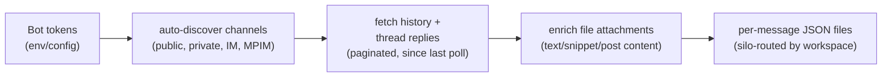

# slack/

Polls Slack channels for new messages across configured workspaces, auto-discovers channels the bot has joined, and writes per-message JSON archives.

## Scripts

| Script | Description |
| --- | --- |
| `poll.ts` | Auto-discovers channels, fetches history and thread replies via Slack API, writes individual JSON files per message to silo-routed directories. Supports multi-account/multi-workspace scenarios. |

## Data Flow



- Loads Slack bot tokens (see [Bot Tokens](#bot-tokens)).
- Discovers all channel types the bot is a member of (public, private, IM, MPIM), excluding archived, for every token's account (IMs always count). Each run refreshes known channels' name and flags from Slack and adds new ones with `_autoDiscovered` (timestamp) and `_account` (the token's account name), in the [Slack cache](#slack-cache-state).
- Fetches paginated conversation history since the last read position per channel. Read positions are instance state in the jeeves-runner state store (see [Read Positions](#read-positions-state)).
- For a channel with new messages, re-reads its members (`conversations.members`) when they are more than a day old; they are written as each message's `participants`.
- Fetches thread replies for threaded messages.
- Enriches text-extractable file attachments (`text`, `post`, `snippet`) by fetching content via `files.info` + `url_private_download` and inlining as `files[].markdown`.
- Persists structured `files[]` metadata (id, name, filetype, mimetype, size) alongside `hasFiles` flag.
- Captures voice memo transcripts from Slack's native transcription (`files[].transcript`).
- Writes one JSON file per message, `{silo}/slack/{channelName} ({channelId})/{ts}.json`; a message whose file already exists is not rewritten.
- Handles channel renames by detecting the directory ending in `({channelId})` under another name and renaming it.
- Resolves workspace routing via `getBasePathForSlackWorkspace()` for multi-workspace setups.
- Names message authors (`userName`: real name, else handle) from the Slack user cache, re-read from `users.list` when more than a day old. An author listed in `people` (`slack` / the channel's `_account`, `default` when unset / user id; [config.md](./config.md#people)) gets the configured name as `userName` and a `personId` field instead; unlisted authors have no `personId`.

## Read Positions (State)

The newest `ts` seen per channel is instance **state**, not config (karmaniverous/jeeves-tools#184). Like the other pollers' cursors (calendar `lastSync-<email>`, github `watch-<user>`), it lives in the jeeves-runner state store (the runner DB, opened with `getRunnerClient()` from `JR_DB_PATH`, which the runner sets for its jobs): namespace `slack`, one scalar key per channel, `lastTs-<channelId>`. A channel's position is written as soon as it advances. Inspect with `GET <runnerUrl()>/state/slack` (the runner's port is in its own config; see [lib.md](./lib.md#runner-configts)).

- No stored position for a channel: that channel is read from the beginning. Message files are deduped by `ts`, so this is safe; it only costs API calls.
- Store unreachable (no `JR_DB_PATH`, missing or uninitialised DB): the poll run fails (`FATAL`, exit 1), even with no channels configured (only the `SLACK_DOMAIN_DIR` skip comes first). It never silently falls back to reading every channel from the beginning.
- A stored position that is not a Slack ts (`<seconds>.<micros>`, e.g. `1700000000.000100`) also fails the run rather than being skipped or used.
- Positions are loaded after channel discovery, so a channel rediscovered after the Slack cache was rebuilt resumes from its stored position.
- The old one-time migration of `lastTs` values out of `channels.json` is gone: the live instance had none left when that file was retired.
- There is no `.local.template`; nothing needs creating on a new instance.

## Slack Cache (State)

Everything Slack can tell us about a channel or user is read from Slack with the bot tokens, never configured. Because Slack rate-limits those calls, the answers are cached in the **state folder**, outside the repo and never committed:

| File | Content | Refreshed |
| --- | --- | --- |
| `{stateDir}/slack/channels.json` | Per channel id: `name`, `type` (`channel`/`dm`/`mpim`), `isPrivate`, `isArchived`, `isSlackConnect`, `sharedTeams`, `participants` (+ `participantsAt`), `_autoDiscovered`, `_account`, `teamId` | Names and flags every run (`conversations.list`); members at most daily, only for channels with new messages; `teamId` once per channel (below) |
| `{stateDir}/slack/accounts.json` | Per gateway Slack account: its workspace (team id) | Once per account (`auth.test`) |
| `{stateDir}/slack/users.json` | Per user id: `name` (handle), `alias` (real name), `emails` (profile email; needs `users:read.email`), `is_bot` | At most daily (`users.list`, every account); users no longer listed are kept |

`teamId` is the channel's workspace, used to pick its silo and, for a channel with no account yet, its token (`lib/channel-workspace.ts`):

- **DMs and MPIMs** belong to the workspace of the bot account that reads them (`_account`), always, with no Slack call.
- **Other channels** are looked up once with `conversations.info`: when they have `shared_team_ids`, the primary workspace if it is among them, else the first of them; without them, or when the channel can't be read, the reading account's workspace.

Each account's workspace comes from `auth.test` with its bot token, cached in `{stateDir}/slack/accounts.json` (`lib/account-teams.ts`; delete the file to re-read). The **primary workspace** is the `default` account's; there is no setting for it.

This replaces the separate `{configDir}/slack-channel-workspaces.json`. Until 2026-10-10 DMs fell back to the primary workspace and were archived in its silo; `jeeves-scripts slack relocate-archives` moves such archives ([cli.md](./cli.md)). An instance moving from that file seeds the cache once with `jeeves-scripts slack seed-cache` ([cli.md](./cli.md)), which carries each channel's recorded account and workspace, except that a DM's workspace is its account's.

`stateDir` is `paths().stateDir` (`{baseDir}/state` unless set). A missing or unreadable cache is rebuilt from Slack on the next run; a failed refresh keeps the cached values. Read and write it with `lib/slack-cache.ts`; the token-metrics DM namer reads `users.json` too.

## Channel Config

What *we* decide about a channel is config, in `jeeves-scripts.json`, and nowhere else:

```json
"slack": {
  "channels": {
    "C0B3CHY4QKX": {
      "project": "jeeves-scripts",
      "homeDir": "J:/domains/projects/jeeves-scripts"
    }
  }
}
```

- `project`: the project the channel belongs to. The watcher tags the channel's indexed messages with it (`resolveSlackChannelMeta`).
- `homeDir`: the channel's home directory, an absolute path (validated). It is where the assistant reads and writes the files a conversation in that channel is about.

Code reads an entry with `getChannelConfig(channelId)` (`lib/channel-config.ts`): `{ project?, homeDir? }`, or `undefined` for a channel with no entry.

**How the assistant finds a channel's home dir:** a Slack message reaches the assistant with its channel id. The assistant looks that id up in the instance's `jeeves-scripts.json` under `slack.channels.<channelId>.homeDir` (in code: `getChannelConfig(id)?.homeDir`). No entry, or no `homeDir`, means the channel has no home dir. (Feeding `homeDir` into the gateway's per-channel prompt is a separate, later change.)

## Bot Tokens

`getTokens()` in `poll.ts` uses the first source that yields a token:

1. `SLACK_BOT_TOKEN` in the job environment (one account, named `default`).
2. The OpenClaw config at `~/.openclaw/openclaw.json` (or, if that file does not exist, the legacy `~/.clawdbot/clawdbot.json`; home is `USERPROFILE` or `HOME`): every `channels.slack.accounts.<name>.botToken`, keyed by account name.
3. The flat `channels.slack.botToken` in that file, as account `default`.

No config file, or no token in it, fails the run. Each channel is read with the token of its account (`_account`, else its Slack Connect `sharedTeams`, else whichever token can resolve it).

## Prerequisites

- A Slack bot token (above). The `pipeline` block is not read.
- The bot must be a member of every channel to archive.
- `SLACK_DOMAIN_DIR` from `constants()`: `{contentDir}/slack`. The run skips (`[skip]`, exit 0) when `SLACK_DOMAIN_DIR` does not exist. Multi-workspace routing: a channel's workspace is its `teamId` in the [Slack cache](#slack-cache-state), and `siloRouting` in `jeeves-scripts.json` maps workspaces to silos (`slackWorkspaces`; [config.md](./config.md)); unmapped workspaces go to the default silo.
- Run under jeeves-runner (or with `JR_DB_PATH` pointing at the runner DB) for read-position state.

| Job          | Schedule     | Manifest          |
| ------------ | ------------ | ----------------- |
| `slack-poll` | Every 11 min | template `jobs/slack.json` |

The manifest entry carries a non-null `prerequisite` naming the token sources in [Bot Tokens](#bot-tokens).

## Key Files

| File | Purpose |
| --- | --- |
| `lib/slack-api.ts` | Typed Slack Web API wrappers — `fetchHistory()`, `fetchReplies()`, `discoverChannels()`, `fetchMembers()`, `fetchUsers()`, `slackApi()`, `SlackFileMetadata` type, with pagination |
| `../lib/constants.ts` | Workspace routing values from `constants()` |
| `../config/silo-router.ts` | `getBasePathForSlackWorkspace()` for output directory routing (see [silos](./config.md#silos)) |
| `lib/channel-config.ts` | `getChannelConfig()` / `channelConfigs()`: the `slack.channels` config |
| `lib/slack-cache.ts` | The Slack cache files in `{stateDir}/slack` (load, save, user display names) |
| `lib/channel-workspace.ts` | A channel's workspace (`teamId` on its cache entry), looked up once; DMs take their account's |
| `lib/account-teams.ts` | Each bot account's workspace (`auth.test`, cached in `{stateDir}/slack/accounts.json`); the primary workspace is the `default` account's |
| `lib/slack-sync.ts` | Refresh the cache from Slack: discovery, users, members |
| `lib/map-helpers.ts` | jeeves-watcher map helpers (namespace `slack`): `resolveSlackUserEmails(ids)` from the user cache, `resolveSlackChannelMeta(id)` = the channel's `slack.channels` entry. Point the watcher's `mapHelpers.slack.path` at the built file, `node_modules/@karmaniverous/jeeves-scripts-core/dist/slack/lib/map-helpers.js` in the instance; it finds the instance config from `JEEVES_SCRIPTS_CONFIG`, else the nearest `jeeves-scripts.json` above it |
| `lib/cursors.ts` | Read-position state in the runner store (`slack` / `lastTs-<channelId>`): Slack ts schema, load, save |
